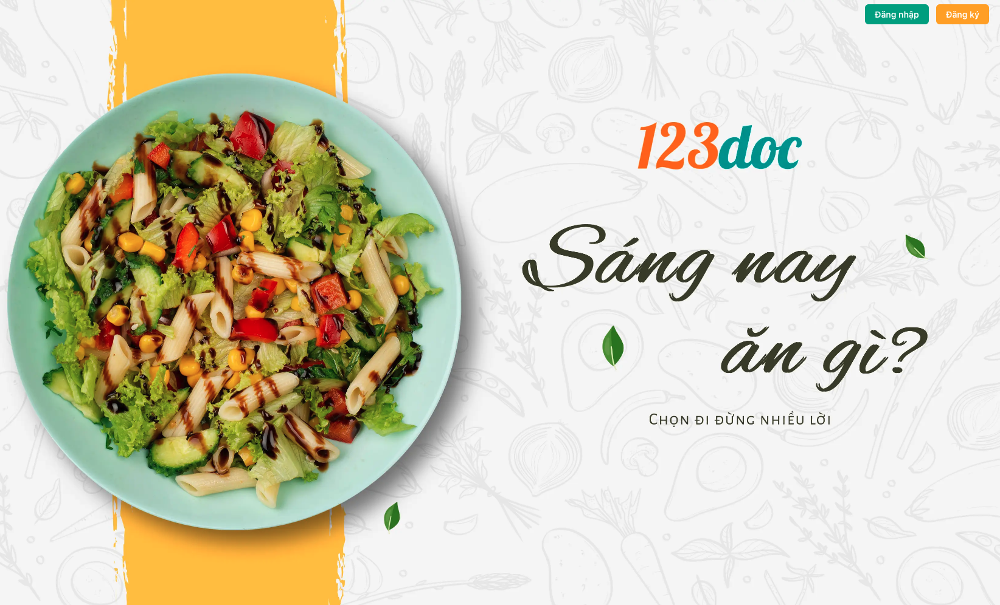
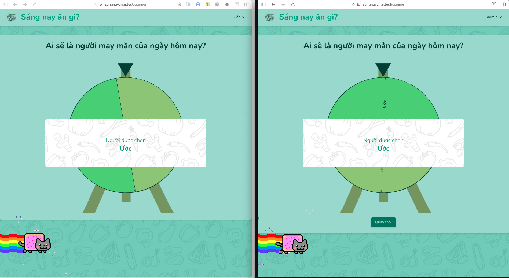
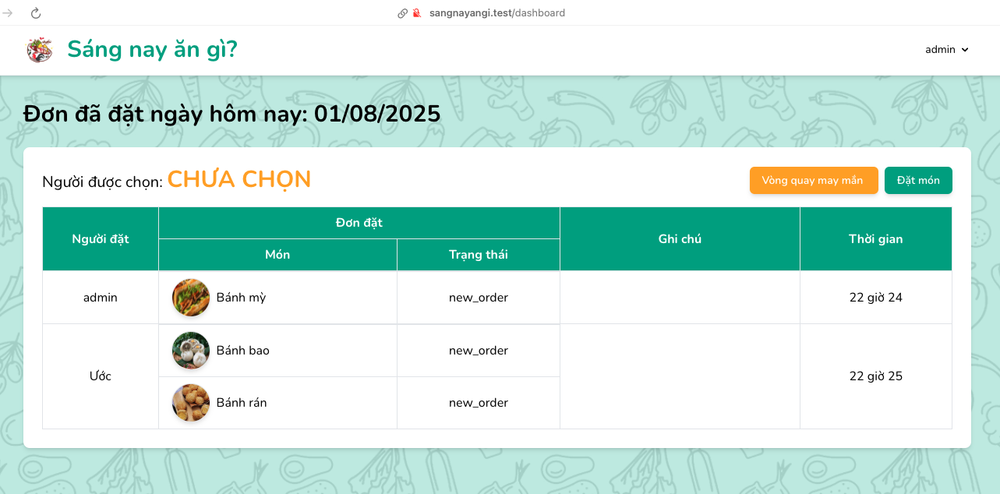
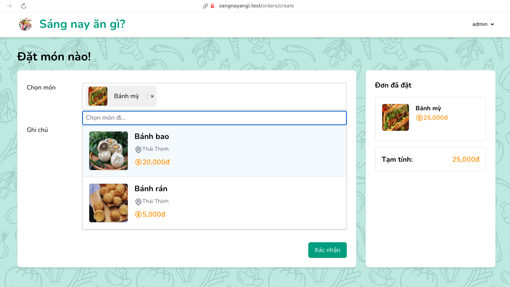

# 🍽️ Sáng Nay Ăn Gì



Ứng dụng web quản lý đặt đồ ăn được xây dựng bằng Laravel, giúp người dùng dễ dàng chọn người mua và đặt đồ ăn theo nhóm.

## 📱 Tính năng chính

- **Quản lý người mua**: Chọn người mua cho từng đơn hàng
- **Thông báo realtime**: Gửi thông báo tức thì khi có người được chọn làm người mua
- **Đặt đồ ăn**: Giao diện trực quan để chọn món ăn
- **Quản lý đơn hàng**: Theo dõi và quản lý các đơn hàng
- **Giao diện admin**: Dashboard quản lý với Orchid Platform
- **Real-time updates**: Cập nhật thời gian thực với Livewire và Pusher

## 🖼️ Giao diện ứng dụng

### Chọn người mua


### Danh sách đơn hàng


### Đặt đồ ăn


## 🛠️ Công nghệ sử dụng

- **Backend**: Laravel 9.x
- **Frontend**: Livewire, Tailwind CSS
- **Admin Panel**: Orchid Platform
- **Database**: MySQL
- **Real-time**: Pusher
- **Authentication**: Laravel Breeze

## 📋 Yêu cầu hệ thống

- PHP >= 8.1
- Composer
- Node.js & NPM
- MySQL
- Web server (Apache/Nginx)

## 🚀 Cài đặt

1. **Clone dự án**
```bash
git clone <repository-url>
cd sangnayangi
```

2. **Cài đặt dependencies**
```bash
composer install
npm install
```

3. **Cấu hình môi trường**
```bash
cp .env.example .env
php artisan key:generate
```

4. **Cấu hình database**
```bash
# Chỉnh sửa file .env với thông tin database
php artisan migrate
php artisan db:seed
```

5. **Build assets**
```bash
npm run build
```

6. **Khởi chạy server**
```bash
php artisan serve
```

## 📁 Cấu trúc dự án

```
sangnayangi/
├── app/
│   ├── Http/
│   │   ├── Controllers/     # Controllers
│   │   ├── Livewire/        # Livewire components
│   │   └── Middleware/      # Custom middleware
│   ├── Models/              # Eloquent models
│   ├── Notifications/       # Realtime notifications
│   ├── Events/              # Broadcast events
│   └── Orchid/              # Admin panel
├── resources/
│   └── views/               # Blade templates
├── routes/                  # Route definitions
└── database/
    └── migrations/          # Database migrations
```

## 🔧 Cấu hình

### Database
Cấu hình database trong file `.env`:
```env
DB_CONNECTION=mysql
DB_HOST=127.0.0.1
DB_PORT=3306
DB_DATABASE=sangnayangi
DB_USERNAME=root
DB_PASSWORD=
```

### Pusher (Real-time)
Cấu hình Pusher cho tính năng real-time:
```env
PUSHER_APP_ID=your_app_id
PUSHER_APP_KEY=your_app_key
PUSHER_APP_SECRET=your_app_secret
PUSHER_HOST=
PUSHER_PORT=443
PUSHER_SCHEME=https
PUSHER_APP_CLUSTER=mt1
```

## 👥 Quản lý người dùng

### Vai trò
- **Admin**: Quản lý toàn bộ hệ thống
- **User**: Đặt đồ ăn và chọn người mua

### Middleware
- `auth`: Xác thực người dùng
- `choosed_buyer`: Kiểm tra đã chọn người mua

### Thông báo Realtime
- **ChooseBuyer Notification**: Gửi thông báo khi có người được chọn làm người mua
- **StartSpinner Event**: Broadcast sự kiện bắt đầu quay spinner
- **Pusher Integration**: Sử dụng Pusher để gửi thông báo realtime
- **Livewire Listeners**: Lắng nghe và xử lý các sự kiện realtime

## 🍽️ Quản lý món ăn

### Model Food
- Tên món ăn
- Giá cả
- Địa chỉ

### Quản lý qua Admin Panel
- Thêm/sửa/xóa món ăn
- Upload hình ảnh
- Phân loại món ăn

## 📊 Quản lý đơn hàng

### Model Order
- Người mua (buyer_id)
- Tổng tiền (amount)
- Ngày đặt (date)
- Chi tiết đơn hàng

### Trạng thái đơn hàng
- Đang xử lý
- Đã xác nhận
- Đã hoàn thành
- Đã hủy

## 🔄 Workflow

1. **Đăng nhập** → Trang chủ
2. **Chọn người mua** → Middleware kiểm tra
3. **Thông báo realtime** → Gửi thông báo cho tất cả người dùng khi có người được chọn
4. **Đặt đồ ăn** → Chọn món và số lượng
5. **Xác nhận đơn hàng** → Lưu vào database
6. **Theo dõi trạng thái** → Real-time updates

## 🎨 Giao diện

### Responsive Design
- Mobile-first approach
- Tailwind CSS styling
- Dark/Light mode support

### Components
- **Livewire Components**: 
  - `ChooseBuyer`: Quản lý chọn người mua với realtime
  - `OrderFood`: Giao diện đặt đồ ăn
- **Notifications**: 
  - `ChooseBuyer`: Thông báo khi chọn người mua
  - `StartSpinner`: Broadcast sự kiện quay spinner
- **Events**: 
  - `StartSpinner`: Event broadcast realtime
- **Blade Components**: Reusable components
- **Custom Layouts**: Admin panel layouts

## 🧪 Testing

```bash
# Chạy tests
php artisan test

# Chạy tests với coverage
php artisan test --coverage
```

## 📦 Deployment

### Production
```bash
# Optimize cho production
php artisan config:cache
php artisan route:cache
php artisan view:cache
composer install --optimize-autoloader --no-dev
```

### Environment Variables
Đảm bảo cấu hình đúng các biến môi trường cho production:
- `APP_ENV=production`
- `APP_DEBUG=false`
- Database credentials
- Pusher credentials

## 🤝 Đóng góp

1. Fork dự án
2. Tạo feature branch (`git checkout -b feature/AmazingFeature`)
3. Commit changes (`git commit -m 'Add some AmazingFeature'`)
4. Push to branch (`git push origin feature/AmazingFeature`)
5. Tạo Pull Request

## 📄 License

Dự án này được cấp phép theo MIT License - xem file [LICENSE](LICENSE) để biết thêm chi tiết.

## 👨‍💻 Tác giả

**Sáng Nay Ăn Gì** - Ứng dụng quản lý đặt đồ ăn

---

⭐ Nếu dự án này hữu ích, hãy cho chúng tôi một star!
